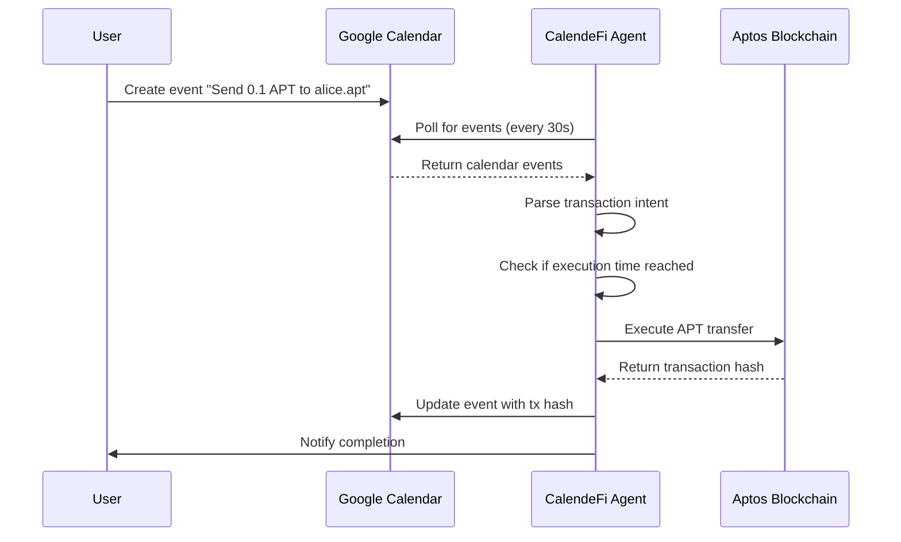

# 📅 CalendeFi - Calendar-Based Cryptocurrency Payments

> Transform your Google Calendar into a powerful cryptocurrency payment scheduler for the Aptos blockchain!


## 🌟 What is CalendeFi?

CalendeFi is an innovative Web2-to-Web3 bridge that converts Google Calendar events into real Aptos blockchain transactions. Simply create a calendar event like "Send 0.1 APT to alice.apt" and watch it execute automatically at the scheduled time!

### ✨ Key Features

- 📅 **Calendar Integration** - Native Google Calendar OAuth integration
- 🚀 **Real Blockchain Transactions** - Execute actual APT transfers on Aptos testnet
- 🤖 **Automated Execution** - Transactions happen automatically at scheduled times
- 💳 **Smart Wallet Management** - Deterministic wallet generation from calendar IDs
- 🌐 **Web Interface** - Beautiful dashboard for wallet and transaction management
- 🔗 **Smart Contract Integration** - Deployed contract for calendar-triggered payments
- 📊 **Real-time Monitoring** - Live transaction status and explorer integration

## 🎯 Quick Example

1. **Create Google Calendar event**: "Send 0.1 APT to 0x1234..."
2. **Set time**: Tomorrow 2:00 PM
3. **Save event**: CalendeFi automatically detects it
4. **Automatic execution**: Transaction executes at 2:00 PM
5. **Calendar updates**: Event shows transaction hash and explorer link

## 🚀 Quick Start

### Prerequisites

- Node.js 18+
- Google Cloud account with Calendar API enabled
- Aptos CLI (optional, for smart contract deployment)

### 1. Clone & Install

```bash
git clone https://github.com/Parthkk90/calendefi.git
cd calendefi/agent
npm install
```

### 2. Environment Setup

```bash
cp .env.example .env.aptos
```

Edit `.env.aptos` with your credentials:

```bash
# Google OAuth Configuration
GOOGLE_CLIENT_ID=your_google_client_id_here
GOOGLE_CLIENT_SECRET=your_google_client_secret_here
GOOGLE_PROJECT_ID=calendefi-demo
GOOGLE_REDIRECT_URI=http://localhost:3001/auth/google/callback
CALENDAR_ID=primary

# Aptos Network Configuration
APTOS_NETWORK=testnet
APTOS_NODE_URL=https://fullnode.testnet.aptoslabs.com/v1
APTOS_FAUCET_URL=https://faucet.testnet.aptoslabs.com

# Server Configuration
PORT=3001
NODE_ENV=development
NEXT_PUBLIC_API_URL=http://localhost:3001

# Demo Configuration
DEMO_MODE=true
DEFAULT_CHAIN_ID=testnet
```

### 3. Start the Agent

```bash
npm run dev
# or
npx ts-node aptosCalendarAgent.ts
```
### 4. Authenticate & Test

1. Visit `http://localhost:3001/auth/google` to authenticate with Google
2. Visit `http://localhost:3001/schedule.html` to create test transactions
3. Create calendar events and watch them execute automatically!

## 📱 Web Interface

### Available Endpoints

- 🏠 **Health Check** - `http://localhost:3001/health`
- 🔐 **Authentication** - `http://localhost:3001/auth/google`
- 💳 **Wallet Info** - `http://localhost:3001/aptos/wallet`
- 📅 **Transaction Scheduler** - `http://localhost:3001/schedule.html`
- 💰 **Wallet Manager** - `http://localhost:3001/wallet.html`
- 📊 **Live Monitor** - `http://localhost:3001/monitor.html`

### Features

- **Wallet Connection** - Connect Petra or Martian wallets
- **Address Book** - Save frequent recipient addresses
- **Transaction Scheduling** - Create calendar events with real addresses
- **Real-time Monitoring** - Track transaction status live
## 🔧 How It Works

### 1. Calendar Event Detection
The agent monitors your Google Calendar every 30 seconds for events matching transaction patterns:

```typescript
// Examples of supported patterns:
"Send 0.1 APT to 0x1234..."
"Transfer 5 APT to alice.apt"
"Pay 0.001 APT to recipient"
```

### 2. Transaction Parsing
Events are parsed using regex patterns to extract:
- **Amount**: Numerical value (e.g., 0.1, 5, 0.001)
- **Token**: Currently supports APT
- **Recipient**: Wallet address or .apt domain
- **Timing**: Scheduled execution time

### 3. Automatic Execution
When the scheduled time arrives:
1. Validate wallet balance
2. Execute real blockchain transaction
3. Update calendar event with results
4. Provide transaction hash and explorer link
## 🏗️ Architecture

```
┌─────────────────┐    ┌──────────────────┐    ┌─────────────────┐
│  Google Calendar │    │   CalendeFi      │    │  Aptos Blockchain│
│                 │    │   Agent          │    │                 │
│  Calendar Events│───▶│                  │───▶│  Smart Contracts│
│  "Send 0.1 APT" │    │  - Event Parser  │    │  - APT Transfers │
│                 │    │  - Wallet Service│    │  - Transaction   │
│  OAuth Tokens   │◀───│  - Scheduler     │    │    Validation   │
└─────────────────┘    └──────────────────┘    └─────────────────┘
                              │
                              ▼
                       ┌──────────────────┐
                       │   Web Interface  │
                       │  - Dashboard     │
                       │  - Wallet Info   │
                       │  - Live Monitor  │
                       └──────────────────┘
```

## 💰 Smart Contract Features

Our deployed Aptos smart contract provides:

- **Calendar Transfers** - Execute payments triggered by calendar events
- **Batch Operations** - Process multiple transactions efficiently
- **Event Validation** - Ensure transaction authenticity
- **Gas Optimization** - Minimize transaction costs

**Deployed Contract**: `0x8dd4f89ac22a7e17a8556adb4df57e1691199afcb419de4c039507b68736cdb4`

## 📊 Supported Operations

### Transaction Types

| Pattern | Description | Example |
|---------|-------------|---------|
| `Send X APT to ADDRESS` | Direct APT transfer | `Send 0.1 APT to 0x1234...` |
| `Transfer X APT to ADDRESS` | Alternative transfer format | `Transfer 5 APT to alice.apt` |
| `Pay X APT to ADDRESS` | Payment format | `Pay 0.001 APT to recipient` |

### Supported Networks

- ✅ **Aptos Testnet** (Current)
- 🔄 **Aptos Mainnet** (Planned)

### Wallet Support

- 🔐 **Deterministic Wallets** - Generated from calendar ID
- 💧 **Auto-funding** - Testnet faucet integration
- 🔗 **External Wallets** - Petra & Martian wallet connections
## 🔄 Transaction Flow



## 🛡️ Security Features

- 🔐 **No Private Key Storage** - Keys generated deterministically
- 🧪 **Testnet Default** - Safe testing environment
- ✅ **Transaction Validation** - Balance checks before execution
- 📝 **Audit Trail** - All transactions logged and verifiable
- 🔍 **Pattern Validation** - Only valid transaction formats processed
## 📈 Real Examples

### Successful Transaction
```
Event: "Send 0.1 APT to 0x742d35cc6bf36c30..."
Status: ✅ Executed
Tx Hash: 0xabc123...
Explorer: https://explorer.aptoslabs.com/txn/0xabc123...
```

### Live Transaction Example
Your transactions are real and verifiable on the Aptos blockchain explorer!

## 📅 Creating Calendar Events for Automatic Execution

### Method 1: Direct Google Calendar (Easiest)
1. **Open**: https://calendar.google.com
2. **Create Event**: Title = "Send 0.1 APT to 0x1234..."
3. **Set Time**: When you want the transaction to execute
4. **Save**: CalendeFi automatically detects and executes it!

### Method 2: Web Interface
- **Scheduler**: http://localhost:3001/schedule.html
- **Live Monitor**: http://localhost:3001/monitor.html

### Method 3: API Integration
```javascript
// Create calendar event via API
const eventData = {
  summary: "Send 0.1 APT to 0x1234...",
  start: { dateTime: "2023-12-01T14:00:00Z" },
  end: { dateTime: "2023-12-01T14:30:00Z" }
};

fetch('/api/calendar/events', {
  method: 'POST',
  headers: { 'Content-Type': 'application/json' },
  body: JSON.stringify(eventData)
});
```
## 🔔 Transaction Confirmation Methods

### 1. Real-Time Console Monitoring
```bash
🚀 EXECUTING REAL TRANSACTION: send 0.1 APT to 0x742d35cc...
✅ Transaction executed: 0xabc123...
📅 Calendar event updated with transaction hash
```

### 2. Live Web Monitor Dashboard
Visit `http://localhost:3001/monitor.html` for real-time updates

### 3. Calendar Event Updates
Events automatically update with transaction results and explorer links

### 4. Blockchain Explorer Verification
Every transaction provides an explorer link for verification

## 🔧 Development

### Prerequisites
- Node.js 18+
- TypeScript
- Google Cloud API credentials
- Aptos CLI (for contract development)

### Environment Variables
Create `.env.aptos` with the following:

```bash
# Required - Google Calendar API
GOOGLE_CLIENT_ID=your_client_id
GOOGLE_CLIENT_SECRET=your_client_secret
GOOGLE_PROJECT_ID=your_project_id
GOOGLE_REDIRECT_URI=http://localhost:3001/auth/google/callback

# Required - Aptos Configuration
APTOS_NETWORK=testnet
APTOS_NODE_URL=https://fullnode.testnet.aptoslabs.com/v1
APTOS_FAUCET_URL=https://faucet.testnet.aptoslabs.com

# Optional - Additional Configuration
PORT=3001
CALENDAR_ID=primary
DEMO_MODE=true
```

### Development Commands
```bash
# Install dependencies
npm install

# Start development server
npm run dev

# Build for production
npm run build

# Start production server
npm start

# Run TypeScript compiler
npx tsc

# Test wallet functionality
curl http://localhost:3001/aptos/wallet
```
## 🚧 Roadmap

### ✅ Completed
- Google Calendar OAuth integration
- Aptos blockchain integration
- Real APT transfers on testnet
- Smart contract deployment
- Web interface for wallet management
- Automatic transaction execution
- Transaction monitoring and confirmation

### 🔄 In Progress
- Enhanced error handling
- Multi-signature support via calendar invitations
- Recurring transaction support

### 📋 Planned
- Aptos mainnet support
- Token swap integration
- Advanced DeFi operations
- Mobile app development
- Enterprise features

## 📚 API Documentation

### Core Endpoints

| Method | Endpoint | Description |
|--------|----------|-------------|
| `GET` | `/health` | Health check |
| `GET` | `/auth/google` | Start OAuth flow |
| `GET` | `/auth/google/callback` | OAuth callback |
| `GET` | `/aptos/wallet` | Get wallet info |
| `POST` | `/aptos/transaction` | Execute transaction |
| `POST` | `/api/calendar/events` | Create calendar event |
| `GET` | `/api/monitor` | Get transaction status |

### Response Formats

```javascript
// Wallet Info Response
{
  "address": "0x742d35cc6bf36c30...",
  "balance": "1.50000000",
  "network": "Aptos Testnet",
  "explorerUrl": "https://explorer.aptoslabs.com/account/0x742d35cc..."
}

// Transaction Response
{
  "txHash": "0xabc123def456...",
  "explorerUrl": "https://explorer.aptoslabs.com/txn/0xabc123...",
  "status": "success"
}
```
## 🤝 Contributing

We welcome contributions! Here's how to get started:

1. **Fork the repository**
2. **Create a feature branch** (`git checkout -b feature/amazing-feature`)
3. **Commit your changes** (`git commit -m 'Add amazing feature'`)
4. **Push to the branch** (`git push origin feature/amazing-feature`)
5. **Open a Pull Request**

### Development Setup
```bash
# Clone your fork
git clone https://github.com/yourusername/calendefi.git
cd calendefi/agent

# Install dependencies
npm install

# Copy environment template
cp .env.example .env.aptos

# Start development server
npm run dev
```

## 🐛 Troubleshooting

### Common Issues

**Agent won't start:**
```bash
# Check Node.js version (requires 18+)
node --version

# Install dependencies
npm install

# Check environment variables
cat .env.aptos
```

**Google authentication fails:**
- Verify client ID/secret in `.env.aptos`
- Check redirect URI matches Google Cloud Console
- Ensure Calendar API is enabled

**Transactions fail:**
- Check wallet has sufficient APT balance
- Verify recipient address format
- Confirm testnet faucet is working

**Calendar events not detected:**
- Verify Google Calendar authentication
- Check event title matches supported patterns
- Ensure agent is running and monitoring

### Debug Mode
```bash
# Enable debug logging
DEBUG=* npm run dev

# Check specific component
DEBUG=calendar* npm run dev
DEBUG=wallet* npm run dev
```
## 📄 License

This project is licensed under the MIT License - see the [LICENSE](LICENSE) file for details.

## 🙏 Acknowledgments

- **Aptos Labs** - For the amazing Aptos blockchain platform
- **Google Calendar API** - For enabling seamless calendar integration
- **Community Contributors** - For testing and feedback
- **Open Source Libraries** - All the amazing packages that made this possible

## 📞 Support

- 📧 **Email**: support@calendefi.com
- 💬 **Discord**: [CalendeFi Community](https://discord.gg/calendefi)
- 🐦 **Twitter**: [@CalendeFi](https://twitter.com/calendefi)
- 🐛 **Issues**: [GitHub Issues](https://github.com/Parthkk90/calendefi/issues)

---

**Made with ❤️ for the Aptos ecosystem**

[🌟 Star this repo](https://github.com/Parthkk90/calendefi) | [🐛 Report Bug](https://github.com/Parthkk90/calendefi/issues) | [💡 Request Feature](https://github.com/Parthkk90/calendefi/issues/new)

## 🎯 Quick Links

- 🚀 [Live Demo](http://localhost:3001) (when running locally)
- 📖 [Documentation](https://github.com/Parthkk90/calendefi/wiki)
- 🎥 [Video Tutorial](https://youtube.com/calendefi)
- 🛠️ [Developer Guide](https://github.com/Parthkk90/calendefi/blob/main/DEVELOPER.md)
- 🔐 [Security Policy](https://github.com/Parthkk90/calendefi/security)

**Start scheduling your crypto payments today with CalendeFi!** 🚀